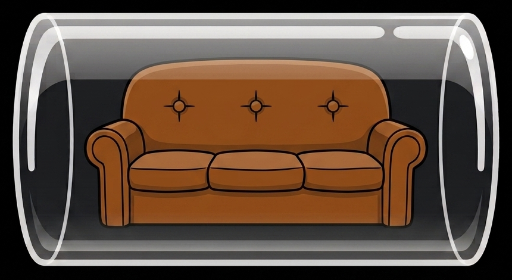

<p align="center">
  
</p>

# CouchTube

A controller-first YouTube client for Windows HTPCs. It recreates the feel of
[SmartTube](https://github.com/yuliskov/SmartTube) on the desktop: a 10-foot,
TV-style interface you drive entirely with a game controller (or the keyboard) -
no browser, no mouse.

Built on [Electron](https://www.electronjs.org/) and
[youtubei.js](https://github.com/LuanRT/YouTube.js) (YouTube's private InnerTube
API), with a companion Android remote for navigation and sending links to the
big screen.

## Why I made this

CouchTube exists because Windows never had a good way to enjoy YouTube from the
couch. As an HTPC user myself, I wanted to browse and watch on the big screen
with just a controller - no browser, no keyboard, no mouse. So I built one.

I also wrote the **CouchTube Remote** companion app for Android. It turns your
phone into a simple remote for CouchTube, and it lets you send any YouTube link
straight to your HTPC - tap share, and it plays on the screen.

Like my other projects, CouchTube is free. I'm releasing it on my son Mihajlo's second
birthday, so in a way it's a present for everyone.

## Features

- **TV-style interface** - categorised home feed, horizontal shelves, and a
  left rail, all navigable with geometry-based spatial focus (D-pad friendly).
- **Full controller + keyboard control** - Gamepad API navigation with tap vs
  long-press, plus a complete keyboard fallback. Bindings are remappable.
- **Google sign-in** - the TV device-code flow. Home, Subscriptions, History,
  Watch Later and playlists all become personalized once you sign in.
- **Multiple accounts** - a "Who's watching" startup picker with full
  per-account isolation, plus a persistent Guest profile.
- **High-quality playback** - DASH via [Shaka Player](https://github.com/shaka-project/shaka-player)
  with SABR streaming (1080p/4K, correct seeking), classic streams as a
  fallback, and live streams via YouTube's DASH manifest.
- **SponsorBlock** - skip sponsor, intro, and other segments, with per-category
  settings and an optional "ask before skip" mode.
- **DeArrow** and **Return YouTube Dislike** style data - de-clickbaited titles
  and real dislike counts.
- **Live chat and comments** - read-only panels for both, docked to the side.
- **On-screen keyboard** with search autocomplete and history.
- **Background playback and a queue** - keep browsing while audio plays, with a
  now-playing mini-player in the rail.
- **Video downloads** - powered by [yt-dlp](https://github.com/yt-dlp/yt-dlp)
  and [ffmpeg](https://ffmpeg.org/), with quick and advanced options, format and
  container selection, and a download queue.
- **Deep settings** mirroring SmartTube - interface, player controls and button
  layout, subtitles, search, SponsorBlock, language/country, theming (colour
  presets and accents), an on-screen clock, backup/restore, and more.
- **HTPC niceties** - launch on Windows startup, single-instance, run in the
  system tray, start minimized, and pre-roll / post-roll shell commands.
- **One-click updates** - check for, download, and install new versions from
  inside the app (Settings > About). No reinstalling by hand.
- **CouchTube Remote** companion support - pair a phone over the LAN (QR or PIN)
  to navigate, type, control playback, and push links to the screen.

## CouchTube Remote (Android companion)

The companion app pairs with CouchTube over your local network (scan a QR code
or type a PIN - no accounts, no cloud). Once paired it acts as a D-pad remote,
a keyboard for search, and a playback controller with a now-playing readout. Its
best trick: **share a YouTube link to it and the video plays on your HTPC** - the
window comes to the front, goes fullscreen, and starts playing. You can also send
CouchTube to fullscreen or hide it back to the tray from your phone.

The Android app lives in its own repository.

## Install and run

### From a release

Download the latest `CouchTube-<version>-win-x64.zip`, extract it anywhere, and
run `CouchTube.exe`. It is fully portable - all data (accounts, settings,
downloads) is stored next to the executable, and it downloads the optional
`yt-dlp`, `ffmpeg`, and `deno` binaries beside itself the first time you use the
download feature.

### From source

```
npm install
npm start
```

Requires Node.js 18+. CouchTube starts fullscreen (F11 toggles).

### Updating

CouchTube updates itself. Open **Settings > About > Check for updates**; when a
newer version is available, choose **Download update** and watch the progress.
When it finishes you can **Restart now** to apply it, or just keep watching - the
update installs automatically the next time you close CouchTube, and the app
reopens on the new version. Your accounts, settings, downloads, and the optional
`yt-dlp` / `ffmpeg` / `deno` binaries are all kept. No manual re-extracting.

If you turn on **Notify me about updates** (Settings > About), CouchTube also
tells you at launch when a new version is out.

## Controls

| Action        | Gamepad (Xbox layout) | Keyboard        |
|---------------|-----------------------|-----------------|
| Move focus    | D-pad / left stick    | Arrow keys      |
| Select        | A                     | Enter           |
| Back          | B                     | Esc             |
| Context menu  | Long-press A          | (long-press)    |
| Play / pause  | X or Start            | Space           |
| Seek +/-10s   | LB/LT and RB/RT       | , and .         |
| Fullscreen    | -                     | F11             |

Controller and keyboard bindings can be remapped per account in Settings.

## Sign in

From the rail choose **Sign in**. A code appears; enter it at
**google.com/device** on your phone. Credentials are stored (DPAPI-encrypted) in
the portable `Data` folder next to the executable and restored on next launch.

Sign-in uses YouTube's TV device-code flow (the same one SmartTube uses). It is
the one login path YouTube leaves open to third parties. Video streams
themselves are fetched anonymously.

## How it works

All YouTube API work runs in the Electron main (Node) process, so the renderer
stays a lightweight TV UI talking to it over IPC - the same architecture
[FreeTube](https://github.com/FreeTubeApp/FreeTube) pioneered.

```
src/main/index.js       Electron main: window, tray, IPC endpoints, CORS handlers
src/main/innertube.js   Data layer: youtubei.js sessions, TV OAuth, feeds, streams
src/main/companion.js   LAN WebSocket server for the CouchTube Remote app
src/main/sponsorblock.js, potoken.js, volume.js, logger.js, system.js
src/preload.js          contextBridge: the minimal window.tv API
src/renderer/           vanilla-JS TV UI (native ES modules, no framework)
  gamepad.js            Gamepad API -> 'tvinput' events (keyboard fallback)
  nav.js                geometry-based spatial focus
  app.js                playback core, input router, boot glue
  sabr.js + vendor/googlevideo.js   SABR streaming adapter beside Shaka
```

## Building a release

```
npm run dist
```

Runs the SABR bundle build (`npm run build:sabr`) and then
`electron-builder --win zip`, producing `dist/CouchTube-<version>-win-x64.zip`.

## Disclaimer

CouchTube talks to YouTube's private InnerTube API, the same way SmartTube and
FreeTube do. It is **unofficial** and not affiliated with, endorsed by, or
sponsored by YouTube or Google. It can break whenever Google changes their API.
Because sign-in uses a Google account, there is a nonzero account risk (as with
any such client) - consider using a secondary account. All YouTube names, logos,
and trademarks belong to Google.

## Credits and acknowledgements

CouchTube stands on a lot of excellent open-source work. Thank you to:

- **[SmartTube](https://github.com/yuliskov/SmartTube)** by Yuriy Liskov - the
  design this project recreates on the desktop, used with the author's kind
  permission for the design. The re-implementation is original code.
- **[youtubei.js](https://github.com/LuanRT/YouTube.js)** and
  **[googlevideo](https://github.com/LuanRT/googlevideo)** by LuanRT - the
  InnerTube client and the SABR streaming layer that make playback possible.
- **[Shaka Player](https://github.com/shaka-project/shaka-player)** by Google -
  DASH/adaptive playback.
- **[FreeTube](https://github.com/FreeTubeApp/FreeTube)** - the reference for the
  main-process architecture and many hard-won InnerTube lessons.
- **[SponsorBlock](https://sponsor.ajay.app/)** and
  **[DeArrow](https://dearrow.ajay.app/)** by Ajay Ramachandran and contributors
  - segment skipping and de-clickbaiting.
- **[Return YouTube Dislike](https://returnyoutubedislike.com/)** - dislike
  counts.
- **[yt-dlp](https://github.com/yt-dlp/yt-dlp)**, **[ffmpeg](https://ffmpeg.org/)**,
  and **[Deno](https://deno.com/)** - the download pipeline.
- **[Electron](https://www.electronjs.org/)**, **[ws](https://github.com/websockets/ws)**,
  **[bonjour-service](https://github.com/onlxltd/bonjour-service)**, and
  **[esbuild](https://esbuild.github.io/)** - the app shell, LAN transport, and
  build tooling.

## License

CouchTube is free software licensed under the
**[GNU General Public License v3.0 or later](LICENSE)**. See the `LICENSE` file
for the full text.
